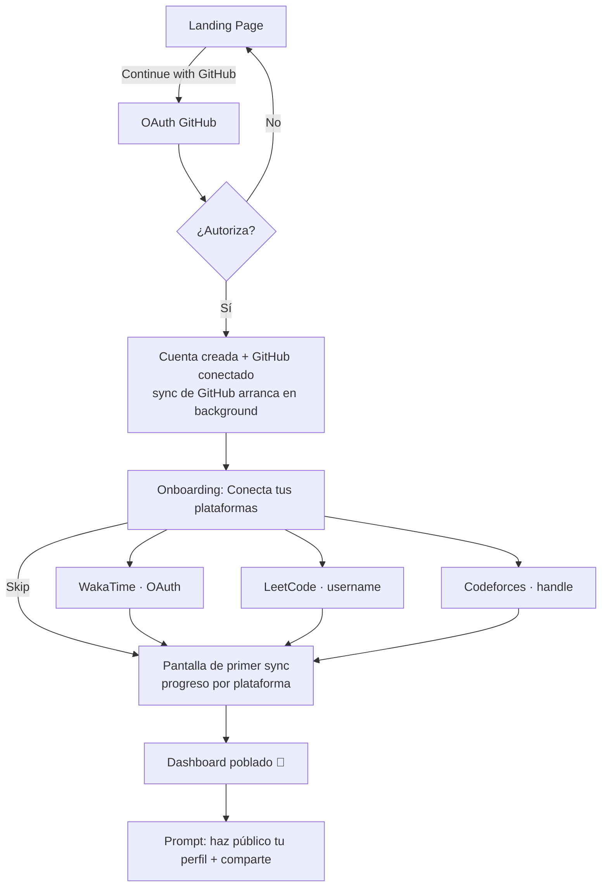
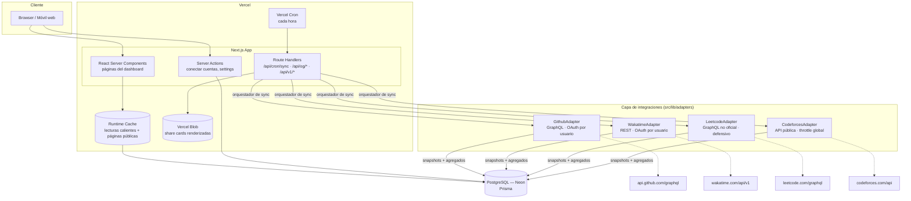

# Developer Dashboard — Documento de Planificación Técnica y de Producto

> **Versión:** 1.0 · **Fecha:** 11 de junio de 2026 · **Autor:** CTO fundador
> **Estado:** Aprobado para ejecución · **Licencia prevista:** AGPL-3.0 · **Stack:** Next.js 16 + TypeScript + PostgreSQL + Prisma + Auth.js + Vercel

**Resumen ejecutivo.** Developer Dashboard es una plataforma open source donde cualquier desarrollador conecta GitHub, LeetCode, Codeforces y WakaTime y obtiene, en un solo lugar, una visualización elegante de toda su actividad técnica: commits, PRs, lenguajes, horas programadas, problemas resueltos, ranking competitivo, streaks y productividad. La experiencia objetivo es "Spotify Wrapped meets Vercel Dashboard": minimalista, dark-first, con gráficos elegantes y share cards diseñadas para hacerse virales. La estrategia es lanzar un MVP en 4 semanas con un "time-to-wow" menor a 3 minutos, y usar la naturaleza open source del proyecto (adapters de plataforma como unidad de contribución) para escalar integraciones con la comunidad.

---

## Índice

1. [Product Vision](#1-product-vision)
2. [Competitive Analysis](#2-competitive-analysis)
3. [MVP Scope](#3-mvp-scope)
4. [User Flow](#4-user-flow)
5. [Database Design](#5-database-design)
6. [System Architecture](#6-system-architecture)
7. [API Integration Plan](#7-api-integration-plan)
8. [Dashboard Design](#8-dashboard-design)
9. [Analytics Ideas](#9-analytics-ideas)
10. [Social Features](#10-social-features)
11. [Roadmap](#11-roadmap)
12. [Open Source Strategy](#12-open-source-strategy)
13. [Future Vision](#13-future-vision)

---

## 1. Product Vision

### 1.1 El problema

La identidad técnica de un desarrollador está **fragmentada en silos que no se hablan entre sí**:

- **GitHub** muestra commits y repos, pero no dice nada del tiempo invertido ni de la habilidad algorítmica.
- **LeetCode** muestra problemas resueltos, pero está aislado y su perfil es feo y poco compartible.
- **Codeforces** tiene el rating competitivo más respetado del mundo, pero es invisible fuera de su nicho.
- **WakaTime** sabe exactamente cuántas horas programas y en qué lenguajes, pero en el plan gratuito solo conserva 14 días de historia.

Las consecuencias concretas:

1. **Para el desarrollador:** no existe una narrativa unificada de su progreso. El esfuerzo real (horas, constancia, aprendizaje) es invisible; solo se ve el output parcial de cada silo.
2. **Para quien evalúa (recruiters, peers):** se juzga por el contributions graph de GitHub, una métrica famosa por ser incompleta y fácil de manipular.
3. **Para la motivación:** los streaks y el progreso viven en 4 sitios distintos; ninguno te da la foto completa que te haría seguir.

### 1.2 La solución

Un dashboard unificado, hermoso y compartible que agrega las 4 fuentes, **guarda la historia para siempre** (resolviendo de paso la limitación de 14 días de WakaTime), calcula métricas propias que ninguna plataforma puede calcular sola (porque cruzan fuentes), y convierte todo en artefactos compartibles: perfil público, share cards y un "Coding Wrapped".

### 1.3 Usuario ideal (personas)

| Persona | Descripción | Qué le duele | Qué le damos |
|---|---|---|---|
| **"El estudiante"** (primaria) | Estudiante de CS o bootcamp, 18–25, construyendo marca personal mientras busca su primer empleo | Su CV no refleja las 500 horas que ha programado este año | Un perfil público que demuestra esfuerzo y constancia, no solo output |
| **"El junior-mid en búsqueda"** | Dev con 1–4 años, activo en LeetCode preparando entrevistas | Su preparación de entrevistas y su trabajo real viven en mundos separados | Una sola URL para el CV/LinkedIn con todo |
| **"El competitivo"** | Usuario activo de Codeforces/LeetCode contests | Su rating 1900 de Codeforces no lo entiende nadie fuera del nicho | Contexto visual: percentiles, evolución, comparación con actividad real de código |
| **"El builder con streak"** | Dev que se motiva con datos: streaks, gráficos, métricas | Pierde la motivación porque el progreso no se ve | Streaks unificados cross-platform, retrospectivas mensuales, Wrapped |

Decisión de producto: **optimizamos para "El estudiante"**. Es el segmento más grande, el más viral (comparte todo), el que más se beneficia de hacer visible el esfuerzo, y el que tiene las 4 cuentas con más frecuencia.

### 1.4 Casos de uso

1. **Portfolio vivo:** una URL (`devdash.app/u/thiago`) en el CV y LinkedIn que se actualiza sola.
2. **Retrospectiva personal:** "¿qué hice este mes/año?" — Wrapped mensual y anual.
3. **Accountability:** streaks unificados ("hoy cuenta si commiteé O resolví un problema O programé 30+ min").
4. **Preparación de entrevistas:** progreso de LeetCode por dificultad y tema, junto al resto de actividad.
5. **Backup de historia:** los snapshots diarios preservan datos que las plataformas pierden (WakaTime free = 14 días).
6. **Comparación social (opt-in):** leaderboards entre amigos o universidad.

### 1.5 Diferenciación

| Frente a... | Nuestra diferencia |
|---|---|
| GitHub stats cards / README hacks | Datos reales multi-plataforma con historia, no SVGs estáticos de una sola fuente |
| WakaTime | Guardamos su propia data más allá de los 14 días gratuitos + la cruzamos con output real |
| Codolio (competidor más cercano) | Open source, diseño premium nivel Linear/Vercel, datos de tiempo (WakaTime), Wrapped y share cards |
| Cualquier alternativa | **Open source + self-hostable + tus datos son tuyos (export completo).** Esto importa muchísimo al público dev |

La tesis central: **el moat no es el dashboard, es la historia acumulada + la distribución viral**. Cada día que un usuario está en la plataforma, su snapshot diario se vuelve más valioso e imposible de reconstruir. Cada share card y cada embed en un README de GitHub es publicidad gratuita dirigida exactamente a nuestro público.

---

## 2. Competitive Analysis

### 2.1 Tabla comparativa

| Producto | Qué hace bien | Limitaciones que explotamos |
|---|---|---|
| **GitHub Profile README + stats cards** (github-readme-stats, etc.) | Distribución masiva, cero fricción, se ve en el perfil | Solo GitHub; SVGs estáticos sin interactividad; sin historia ni tendencias; estética limitada por el sandbox de GitHub; frecuentes problemas de rate limit |
| **GitHub Contributions Graph** | Icónico, universalmente entendido | Solo commits/PRs de GitHub; sin contexto (un commit de 1 línea = un día de trabajo); famoso por ser manipulable; no mide tiempo ni aprendizaje |
| **WakaTime Dashboard** | La mejor data de tiempo de programación que existe; integraciones con todos los editores | Solo tiempo; **plan free = 14 días de historia** (su mayor debilidad y nuestra mayor oportunidad); diseño funcional pero no aspiracional; nada compartible/viral |
| **LeetCode Profile** | Data de problemas y contests precisa; heatmap propio | Silo total; perfil no diseñado para compartir; sin API oficial; cero contexto sobre el resto de tu vida como dev |
| **Codeforces Profile** | El rating competitivo más respetado; API pública y abierta | UI de 2010; ilegible para no-competitivos; aislado |
| **Codolio** | Agrega LeetCode + Codeforces + GFG + GitHub; question tracker; popular en India | Closed source; diseño cargado y denso (anti-Linear); sin datos de tiempo; sin Wrapped ni share cards de calidad; sin self-host |
| **Devfolio** | Portfolio + hackathons, comunidad fuerte | Es un constructor de portfolios manual, no un dashboard de métricas automático; foco en hackathons |
| **daily.dev DevCard** | Card compartible bonita, viral | Solo mide actividad de lectura en daily.dev, no tu trabajo real |
| **Peerlist** | Perfil profesional con integraciones | Closed source; foco en networking/empleo, las métricas son secundarias |
| **Stack Overflow Developer Story** | Validó la idea de "identidad dev unificada" | **Discontinuado en 2022** — lección: no puede ser una feature secundaria de otra plataforma, tiene que ser el producto entero |

### 2.2 Oportunidades de mejora identificadas

1. **Nadie cruza las tres dimensiones:** output (GitHub) × tiempo (WakaTime) × habilidad algorítmica (LeetCode/CF). Las métricas más interesantes (consistencia real, velocidad de aprendizaje) solo existen cruzando fuentes.
2. **Nadie guarda historia que las plataformas pierden.** Snapshots diarios desde el día 1 = ventaja compuesta.
3. **El diseño del nicho es mediocre.** Codolio es denso, WakaTime es utilitario, Codeforces es arcaico. Hay espacio para "el Linear de las métricas dev".
4. **Nadie ha hecho el "Wrapped" bien.** GitHub Wrapped/Unwrapped son proyectos de terceros que viven 2 semanas en diciembre. Un Wrapped mensual + anual nativo, con datos de 4 fuentes, es un motor viral recurrente.
5. **Nadie del espacio es open source.** Para el público dev, OSS no es un detalle: es confianza (tus tokens, tus datos), es distribución (GitHub trending, HN) y es mano de obra (contributors que añaden integraciones).
6. **El embed en README es un canal de distribución sin dueño.** Una stats card nuestra, embebible y más rica que github-readme-stats, pone un backlink en miles de perfiles.

---

## 3. MVP Scope

**Principio de corte:** todo lo que entra debe contribuir a un **"time-to-wow" < 3 minutos** (de landing a dashboard poblado que dan ganas de compartir) y sobrevivir la pregunta *"¿lo enseñarías en una demo de 60 segundos?"*. Todo lo demás espera.

### 3.1 Entra en el MVP ✅

| Funcionalidad | Por qué entra |
|---|---|
| Login con GitHub (Auth.js) | Cero fricción para el público objetivo y el mismo OAuth da acceso a la API de GitHub |
| Conexión de las 4 plataformas (GitHub OAuth, WakaTime OAuth, LeetCode y Codeforces por username/handle) | Es la propuesta de valor central; sin las 4 no hay diferenciación |
| Sync diario automático + botón de refresh manual (cooldown 1 h) | Sin datos frescos el producto está muerto; el cooldown protege rate limits |
| Snapshots diarios persistentes | El moat. Costo marginal mínimo, valor compuesto. Imprescindible desde el día 1 por los 14 días de WakaTime |
| Dashboard principal: KPIs, heatmap unificado, lenguajes, horas semanales, problemas por dificultad, evolución de rating, streak | El "wow". Las ~8 visualizaciones core que cubren todas las métricas pedidas |
| Productividad semanal y mensual (agregados precalculados) | Pedida explícitamente; barata de calcular sobre snapshots |
| Perfil público (`/u/<slug>`) con toggle de privacidad por plataforma | El loop viral mínimo: sin URL compartible no hay crecimiento orgánico |
| 1 share card (imagen OG dinámica del perfil) | Suficiente para validar el loop de compartir; las variantes vienen después |
| Settings: conexiones, privacidad, export de datos (JSON), borrar cuenta | Privacidad y data ownership son parte de la promesa OSS; legalmente necesario (GDPR) |
| Modo demo con datos seed | Crítico para contributors (desarrollan sin API keys) y para la demo de la landing |

### 3.2 Queda para después ⏳

| Funcionalidad | Por qué espera | Cuándo |
|---|---|---|
| Coding Wrapped completo (modo historia) | Alto esfuerzo de diseño/animación; necesita semanas de datos acumulados para brillar | v1.1 (mes 2) — idealmente listo para diciembre |
| Scores compuestos (Builder Score, etc.) | Necesitan datos históricos y calibración para no dar números absurdos | v1.1, con 30+ días de snapshots |
| Achievements y badges | Motor de retención, no de adquisición; el MVP necesita adquisición | v1.2 |
| Leaderboards / rankings globales | Necesitan masa crítica de usuarios; con 50 usuarios un ranking es triste | v1.2+ |
| Verificación de propiedad de LeetCode/Codeforces (badge "verificado") | Los datos son públicos; el MVP marca las cuentas como "no verificadas" y funciona igual | v1.1 |
| Embed SVG para README de GitHub | Enorme para distribución, pero requiere infraestructura de rendering aparte | v1.1 (prioridad alta) |
| Más integraciones (AtCoder, HackerRank, GitLab...) | Cada adapter es mantenimiento; mejor que los añada la comunidad sobre una interfaz estable | Post-launch, vía contributors |
| Equipos / organizaciones | Otro producto distinto; B2B llega cuando B2C funcione | Fase futura (§13) |
| Apps móviles / extensión de navegador | El web responsive cubre el caso de uso del MVP | Fase futura |

---

## 4. User Flow

### 4.1 Flujo principal: de usuario nuevo a dashboard completo



### 4.2 Paso a paso detallado

1. **Landing** (`/`). Hero con un dashboard demo *real e interactivo* (datos seed), un único CTA: **"Continue with GitHub"**. Nada de formularios de email.
2. **OAuth GitHub.** Scopes mínimos: `read:user` (+ opt-in posterior a `repo` para incluir repos privados en las cuentas, nunca su contenido). Auth.js crea `User` + `Account`, ciframos el token y **lanzamos inmediatamente el primer sync de GitHub en background** — para cuando el usuario termine el onboarding, ya hay datos.
3. **Onboarding** (`/onboarding`). Una sola pantalla con 4 tarjetas de conexión:
   - **GitHub:** ya conectada ✓ (mostramos avatar y username — primer momento de confianza).
   - **WakaTime:** botón "Conectar" → OAuth de WakaTime → vuelta con tokens guardados.
   - **LeetCode:** input de username → validación inmediata contra la API (existe + mostramos su avatar y stats para confirmar "¿eres tú?").
   - **Codeforces:** input de handle → misma validación con `user.info`.
   - Botón **"Continuar →"** activo desde el primer momento (solo GitHub es obligatoria; el resto se puede conectar luego en Settings). Las cuentas por username quedan marcadas "sin verificar" (badge de verificación: v1.1, ver §7.5).
4. **Primer sync** (`/onboarding/sync`). Pantalla de progreso con una fila por plataforma y estados en vivo (`pendiente → sincronizando → ✓ n datos importados`), alimentada por polling al estado de `sync_jobs`. Mensajes con personalidad ("Contando tus commits…", "Preguntándole a Codeforces por tu rating…"). Duración objetivo: < 30 s. Si una plataforma falla, no bloquea: "lo reintentamos en background".
5. **Dashboard** (`/dashboard`). Aterriza con datos reales y una animación sutil de entrada (los números cuentan hacia arriba, los gráficos se dibujan). **Este es el momento "wow" y todo el funnel existe para llegar aquí en < 3 minutos.**
6. **Activación del loop viral.** Banner dismissible: "Tu perfil es privado. Hazlo público y compártelo → `devdash.app/u/thiago`". Al activarlo, modal con la share card generada y botones de compartir en X/LinkedIn.
7. **Recurrencia.** El cron sincroniza cada cuenta a diario. El usuario vuelve por el streak, el refresh manual y (v1.1) el email de resumen semanal.

### 4.3 Flujos secundarios

- **Conectar plataforma más tarde:** Settings → Connections → misma UI de tarjetas del onboarding.
- **Desconectar plataforma:** confirmación → se borran tokens y se anonimiza la cuenta; los snapshots históricos se conservan salvo que el usuario marque "borrar también mi historia".
- **Sync fallido persistente:** badge de error en Settings con causa legible ("WakaTime revocó el acceso — reconecta") + email tras 3 fallos consecutivos.
- **Borrado de cuenta:** doble confirmación → borrado físico de todo (usuario, tokens, snapshots) en cascada.

---

## 5. Database Design

PostgreSQL + Prisma. Decisiones estructurales antes del esquema:

1. **Una tabla por plataforma** (`github_accounts`, etc.) en lugar de una tabla genérica `connected_accounts`: cada plataforma tiene campos propios fuertemente tipados (rating de CF, scopes de OAuth, etc.) y el código de cada adapter queda más simple y seguro.
2. **`daily_snapshots` es la tabla central del producto**: una fila por usuario × plataforma × día, con columnas tipadas para las métricas "calientes" (las que dibujan gráficos) y un `raw Json` para extras específicos de plataforma. Todos los gráficos leen de aquí — **nunca de las APIs externas**.
3. **`metric_aggregates` precalcula semana/mes** en el momento del sync, para que el dashboard sean `SELECT`s triviales.
4. **Tokens OAuth cifrados** (AES-256-GCM con clave en env var) en columnas dedicadas, nunca en texto plano.
5. **Retención: para siempre.** Los snapshots son el moat (~200 bytes/fila ⇒ un usuario con 4 plataformas ≈ 290 KB/año — trivial).

### 5.1 Esquema Prisma (diseño)

```prisma
// ============ AUTH (Auth.js estándar) ============

model User {
  id            String    @id @default(cuid())
  name          String?
  email         String?   @unique
  emailVerified DateTime?
  image         String?
  username      String?   @unique        // slug del perfil público
  createdAt     DateTime  @default(now())
  updatedAt     DateTime  @updatedAt

  accounts          Account[]            // OAuth de Auth.js
  sessions          Session[]
  githubAccount     GithubAccount?
  wakatimeAccount   WakatimeAccount?
  leetcodeAccount   LeetcodeAccount?
  codeforcesAccount CodeforcesAccount?
  snapshots         DailySnapshot[]
  aggregates        MetricAggregate[]
  scores            Score[]
  syncJobs          SyncJob[]
  publicProfile     PublicProfile?
  shareCards        ShareCard[]

  @@map("users")
}

model Account {            // tabla estándar de Auth.js (proveedores OAuth de login)
  id                String  @id @default(cuid())
  userId            String
  type              String
  provider          String
  providerAccountId String
  refresh_token     String? @db.Text
  access_token      String? @db.Text
  expires_at        Int?
  token_type        String?
  scope             String?
  id_token          String? @db.Text
  user              User    @relation(fields: [userId], references: [id], onDelete: Cascade)

  @@unique([provider, providerAccountId])
  @@map("accounts")
}

model Session {
  id           String   @id @default(cuid())
  sessionToken String   @unique
  userId       String
  expires      DateTime
  user         User     @relation(fields: [userId], references: [id], onDelete: Cascade)
  @@map("sessions")
}

// ============ CUENTAS DE PLATAFORMA ============

enum SyncStatus {
  IDLE
  SYNCING
  ERROR
}

model GithubAccount {
  id                String     @id @default(cuid())
  userId            String     @unique
  githubId          String     @unique      // id numérico inmutable de GitHub
  login             String                  // username (puede cambiar)
  avatarUrl         String?
  encryptedToken    String     @db.Text     // OAuth token cifrado AES-256-GCM
  scopes            String                  // "read:user" | "read:user,repo"
  includePrivate    Boolean    @default(false)
  syncStatus        SyncStatus @default(IDLE)
  lastSyncedAt      DateTime?
  lastSyncError     String?
  consecutiveErrors Int        @default(0)
  createdAt         DateTime   @default(now())
  user              User       @relation(fields: [userId], references: [id], onDelete: Cascade)

  @@index([lastSyncedAt])                   // el orquestador busca las más "viejas"
  @@map("github_accounts")
}

model WakatimeAccount {
  id                    String     @id @default(cuid())
  userId                String     @unique
  wakatimeId            String     @unique
  displayName           String?
  encryptedAccessToken  String     @db.Text
  encryptedRefreshToken String     @db.Text
  tokenExpiresAt        DateTime
  syncStatus            SyncStatus @default(IDLE)
  lastSyncedAt          DateTime?
  lastSyncError         String?
  consecutiveErrors     Int        @default(0)
  createdAt             DateTime   @default(now())
  user                  User       @relation(fields: [userId], references: [id], onDelete: Cascade)

  @@index([lastSyncedAt])
  @@map("wakatime_accounts")
}

model LeetcodeAccount {
  id                String     @id @default(cuid())
  userId            String     @unique
  username          String                  // handle público; sin OAuth
  verified          Boolean    @default(false)   // badge v1.1, ver §7.5
  verificationCode  String?                 // código a colocar en el summary del perfil
  syncStatus        SyncStatus @default(IDLE)
  lastSyncedAt      DateTime?
  lastSyncError     String?
  consecutiveErrors Int        @default(0)
  createdAt         DateTime   @default(now())
  user              User       @relation(fields: [userId], references: [id], onDelete: Cascade)

  @@index([lastSyncedAt])
  @@map("leetcode_accounts")
}

model CodeforcesAccount {
  id                String     @id @default(cuid())
  userId            String     @unique
  handle            String
  verified          Boolean    @default(false)
  verificationCode  String?
  syncStatus        SyncStatus @default(IDLE)
  lastSyncedAt      DateTime?
  lastSyncError     String?
  consecutiveErrors Int        @default(0)
  createdAt         DateTime   @default(now())
  user              User       @relation(fields: [userId], references: [id], onDelete: Cascade)

  @@index([lastSyncedAt])
  @@map("codeforces_accounts")
}

// ============ DATOS: SNAPSHOTS Y AGREGADOS ============

enum Platform {
  GITHUB
  WAKATIME
  LEETCODE
  CODEFORCES
}

/// Una fila por usuario × plataforma × día. LA tabla del producto.
/// Columnas tipadas = métricas que dibujan gráficos. `raw` = extras por plataforma.
model DailySnapshot {
  id       String   @id @default(cuid())
  userId   String
  platform Platform
  date     DateTime @db.Date

  // --- GitHub ---
  commits        Int?
  pullRequests   Int?               // PRs abiertos ese día
  prsMerged      Int?
  issuesOpened   Int?
  reviews        Int?
  starsReceived  Int?               // total acumulado (gauge, no delta)
  totalRepos     Int?

  // --- WakaTime ---
  codingSeconds  Int?               // segundos programados ese día
  topLanguage    String?
  languages      Json?              // [{ name, seconds }] del día

  // --- LeetCode ---
  problemsSolvedTotal Int?          // acumulado (gauge)
  solvedEasy          Int?
  solvedMedium        Int?
  solvedHard          Int?
  contestRating       Int?

  // --- Codeforces ---
  cfRating       Int?
  cfMaxRating    Int?
  cfRank         String?            // "expert", "candidate master"...
  cfProblemsSolvedTotal Int?
  cfSubmissions  Int?               // submissions de ese día

  raw       Json?                   // payload extra específico de plataforma
  createdAt DateTime @default(now())
  user      User     @relation(fields: [userId], references: [id], onDelete: Cascade)

  @@unique([userId, platform, date])
  @@index([userId, date])           // rango de fechas para gráficos
  @@map("daily_snapshots")
}

enum AggregatePeriod {
  WEEKLY
  MONTHLY
}

/// Precalculado en cada sync: el dashboard lee de aquí sin agregar nada en caliente.
model MetricAggregate {
  id          String          @id @default(cuid())
  userId      String
  period      AggregatePeriod
  periodStart DateTime        @db.Date   // lunes ISO o día 1 del mes
  commits        Int    @default(0)
  prsMerged      Int    @default(0)
  issuesOpened   Int    @default(0)
  codingSeconds  Int    @default(0)
  problemsSolved Int    @default(0)
  activeDays     Int    @default(0)      // días con ≥1 evento significativo
  topLanguages   Json?                   // top 5 [{ name, seconds }]
  user        User @relation(fields: [userId], references: [id], onDelete: Cascade)

  @@unique([userId, period, periodStart])
  @@map("metric_aggregates")
}

/// Scores propios (§9), versionados para poder recalibrar fórmulas.
model Score {
  id             String   @id @default(cuid())
  userId         String
  kind           String   // "consistency" | "open_source" | "productivity" | "learning_velocity" | "builder"
  value          Float
  breakdown      Json     // componentes de la fórmula, para UI transparente
  formulaVersion Int      @default(1)
  computedAt     DateTime @default(now())
  user           User     @relation(fields: [userId], references: [id], onDelete: Cascade)

  @@unique([userId, kind])
  @@map("scores")
}

// ============ SYNC ============

enum SyncJobStatus {
  QUEUED
  RUNNING
  SUCCESS
  FAILED
}

/// Registro de cada ejecución de sync: observabilidad + alimenta la UI de progreso.
model SyncJob {
  id          String        @id @default(cuid())
  userId      String
  platform    Platform
  status      SyncJobStatus @default(QUEUED)
  trigger     String        // "cron" | "manual" | "onboarding"
  startedAt   DateTime?
  finishedAt  DateTime?
  error       String?
  itemsSynced Int?
  createdAt   DateTime      @default(now())
  user        User          @relation(fields: [userId], references: [id], onDelete: Cascade)

  @@index([userId, createdAt])
  @@index([status, createdAt])
  @@map("sync_jobs")
}

// ============ SOCIAL ============

model PublicProfile {
  id            String   @id @default(cuid())
  userId        String   @unique
  slug          String   @unique          // devdash.app/u/<slug>
  isPublic      Boolean  @default(false)
  bio           String?
  showGithub    Boolean  @default(true)   // privacidad por plataforma
  showWakatime  Boolean  @default(true)
  showLeetcode  Boolean  @default(true)
  showCodeforces Boolean @default(true)
  viewCount     Int      @default(0)
  createdAt     DateTime @default(now())
  updatedAt     DateTime @updatedAt
  user          User     @relation(fields: [userId], references: [id], onDelete: Cascade)

  @@map("public_profiles")
}

model ShareCard {
  id        String   @id @default(cuid())
  userId    String
  kind      String   // "profile" | "wrapped_2026" | "monthly_2026_06" ...
  theme     String   @default("dark")
  imageUrl  String?  // cacheada en Vercel Blob
  createdAt DateTime @default(now())
  user      User     @relation(fields: [userId], references: [id], onDelete: Cascade)

  @@unique([userId, kind, theme])
  @@map("share_cards")
}

// v1.2 — definidos ya para que la comunidad pueda proponer badges desde el día 1
model Achievement {
  id          String @id @default(cuid())
  code        String @unique   // "streak_30", "first_hard", "polyglot_5"...
  name        String
  description String
  icon        String
  @@map("achievements")
}
```

### 5.2 Notas de diseño

- **Gauges vs deltas:** métricas acumulativas (rating, total de problemas, stars) se guardan como valor absoluto del día; los gráficos de "progreso" se calculan por diferencia entre snapshots. Métricas de actividad (commits, submissions, segundos) se guardan como valor del día.
- **Backfill:** GitHub y Codeforces permiten reconstruir el pasado (contributions calendar / lista completa de submissions), así que el primer sync rellena hasta 1 año de snapshots retroactivos. WakaTime solo permite 14 días hacia atrás (free) y LeetCode da el calendario de submissions del año (conteos por día). El adapter declara su capacidad de backfill.
- **Cascadas:** todo cuelga de `User` con `onDelete: Cascade` → el borrado de cuenta GDPR es un solo `DELETE`.
- **Migraciones:** Prisma Migrate desde el primer commit; nada de `db push` en main.

---

## 6. System Architecture

### 6.1 Diagrama general



### 6.2 Frontend

- **Next.js 16 App Router, RSC-first.** Las páginas del dashboard son Server Components que leen de Postgres vía Prisma (queries triviales gracias a snapshots/agregados). Solo los gráficos y micro-interacciones son Client Components.
- **UI:** Tailwind CSS + shadcn/ui (tokens customizados, ver §8.1) + **Recharts** para gráficos + **Framer Motion** para animaciones de entrada y contadores.
- **Estado:** casi inexistente — el servidor renderiza datos; el cliente solo maneja el rango de fechas (URL search params, para que todo dashboard sea enlazable) y el polling del estado de sync durante el onboarding.

### 6.3 Backend

- **Server Actions** para todas las mutaciones del usuario: conectar/desconectar cuentas, cambiar privacidad, pedir refresh manual. Validación con Zod, autorización por sesión en cada action.
- **Route Handlers** solo para lo que necesita ser HTTP: el endpoint de cron (protegido por `CRON_SECRET`), generación de imágenes OG (`/api/og/*` con `@vercel/og`), callbacks de OAuth y la futura API pública (`/api/v1/*`).
- **Fluid Compute (default de Vercel)** con timeout de 300 s — suficiente para procesar lotes de sync sin infraestructura adicional.

### 6.4 Capa de integraciones: el patrón `PlatformAdapter`

Cada plataforma implementa una interfaz común — **esta interfaz es la pieza arquitectónica más importante del proyecto**, porque es la unidad de contribución open source (§12):

```
interface PlatformAdapter {
  platform: Platform
  validateHandle(handle): Promise<PublicProfilePreview>   // onboarding
  sync(account, { backfill }): Promise<DailyMetric[]>     // produce snapshots
  verifyOwnership?(account): Promise<boolean>             // v1.1, opcional
  rateLimit: { maxConcurrent, minDelayMs, dailyBudget }   // declarativo
  backfillCapability: { maxDays }                         // cuánta historia puede reconstruir
}
```

El orquestador no sabe nada de GitHub ni de LeetCode: itera adapters, respeta el `rateLimit` declarado de cada uno, escribe `DailySnapshot`s y recalcula `MetricAggregate`s y `Score`s. Añadir AtCoder = un archivo nuevo que implementa la interfaz + un modelo de cuenta.

### 6.5 Cron jobs y orquestación de sync

- **Vercel Cron → `/api/cron/sync` cada hora.** Cada ejecución toma las N cuentas con `lastSyncedAt` más antiguo (y > 20 h, para frecuencia efectiva diaria con jitter natural), las procesa en lotes dentro del timeout y marca `SyncJob`s. Si la ejecución muere, la siguiente hora retoma donde quedó — **el cron es stateless y reentrante**, no hay cola que mantener.
- **Refresh manual:** Server Action con cooldown de 1 h/usuario (verificado contra `lastSyncedAt`), encola un `SyncJob` con `trigger: "manual"` que un handler procesa inmediatamente.
- **Fallos:** backoff exponencial vía `consecutiveErrors` (1 fallo → reintento siguiente hora; 3+ → cada 24 h + aviso al usuario). Errores 401/403 (token revocado) marcan la cuenta para reconexión sin reintentos.
- **Escalado futuro:** cuando el volumen supere lo que cabe en ejecuciones de cron, el orquestador migra a **Vercel Queues** (mismo código de adapter, solo cambia el dispatcher). Decisión consciente: no añadir colas hasta que duela.

### 6.6 Caching (3 niveles)

| Nivel | Qué | TTL / invalidación |
|---|---|---|
| **1. Snapshots en DB** | La caché fundamental: el dashboard **nunca** toca APIs externas en request-path | Se actualiza en cada sync |
| **2. Runtime Cache / `use cache`** | Páginas de perfil público y respuestas de agregados | TTL 1 h + invalidación por tag (`user:<id>`) al terminar un sync |
| **3. Imágenes OG en Blob + CDN** | Share cards renderizadas | Regeneradas tras cada sync; servidas con `Cache-Control` largo |

### 6.7 Rate limits (resumen operativo)

- **GitHub:** el token OAuth de cada usuario tiene su propio presupuesto (5.000 puntos GraphQL/h) → **escala linealmente con los usuarios**, sin cuello de botella global.
- **Codeforces y LeetCode:** presupuesto **global** de la app → throttle compartido (cola secuencial con `minDelayMs`) + jitter en el cron para repartir la carga en el día. Detalle por plataforma en §7.
- **Regla transversal:** todo adapter respeta `429`/`Retry-After`, implementa circuit breaker (tras X fallos seguidos, pausa la plataforma entera 1 h) y degrada con gracia: una plataforma caída nunca rompe el dashboard, solo muestra "última actualización: hace N horas".

---

## 7. API Integration Plan

### 7.1 GitHub

| | |
|---|---|
| **Acceso** | GraphQL API v4 con el token OAuth del propio usuario (obtenido en el login con Auth.js). Scopes: `read:user`; opt-in a `repo` para contar actividad privada |
| **Datos** | `viewer.contributionsCollection` → calendario de contribuciones diarias (commits, PRs, issues, reviews) de hasta 1 año por query; `repositories` → repos, stars, lenguajes (bytes por lenguaje); `pullRequests`/`issues` con filtros de fecha |
| **Rate limit** | 5.000 puntos/h **por token de usuario** — en la práctica ilimitado para nuestro caso (un sync completo ≈ 10–30 puntos) |
| **Historia** | Excelente: backfill de 1 año en 1 query (más años = 1 query por año) |
| **Sync** | Diario incremental (solo el día corriente y el anterior); backfill de 365 días en el primer sync |
| **Riesgo** | **Bajo.** API estable, oficial, documentada. El único cuidado: tokens revocados → marcar para reconexión |

### 7.2 WakaTime

| | |
|---|---|
| **Acceso** | OAuth 2.0 oficial (access + refresh token, con rotación). REST API v1 |
| **Datos** | `GET /users/current/summaries?start&end` → segundos programados por día, desglose por lenguaje, proyecto y editor; `GET /users/current/stats` → agregados; `GET /users/current` → perfil |
| **Rate limit** | Por usuario autenticado; generoso para llamadas diarias. Respetar `429 + Retry-After` |
| **Historia** | ⚠️ **Plan free: solo 14 días.** Esta es la restricción que define nuestra arquitectura: snapshots propios obligatorios desde el primer día. Mensaje de producto: *"conecta WakaTime hoy; nosotros guardamos tu historia gratis para siempre"* |
| **Sync** | Diario: `summaries` de los últimos 2 días (el de ayer puede haber cambiado por heartbeats tardíos). Primer sync: backfill de los 14 días disponibles |
| **Riesgo** | **Bajo-medio.** API oficial y estable; gestionar bien la rotación del refresh token (si caduca sin renovar, pedir reconexión) |

### 7.3 LeetCode

| | |
|---|---|
| **Acceso** | ❌ Sin API oficial ni OAuth. Endpoint GraphQL público no documentado (`leetcode.com/graphql`), solo username. Queries conocidas: `matchedUser(username)` → `submitStatsGlobal` (resueltos por dificultad), `profile` (ranking, avatar), `userCalendar.submissionCalendar` (conteo de submissions por día del último año), `userContestRanking` (rating de contests) |
| **Rate limit** | No publicado; protegido por Cloudflare. Operar **muy** conservadoramente: ≤ 1 req/2 s global, User-Agent identificable, circuit breaker agresivo |
| **Historia** | `submissionCalendar` da ~1 año de conteos diarios → backfill razonable de actividad (no de dificultad por día) |
| **Sync** | Diario: 1–2 queries por usuario. Los totales por dificultad son gauges; el delta diario sale de la diferencia entre snapshots |
| **Riesgo** | 🔴 **Alto — el mayor riesgo técnico del proyecto.** El esquema puede cambiar o el acceso endurecerse sin aviso. Mitigación: (1) adapter totalmente aislado tras la interfaz — si muere, el resto del producto no se entera; (2) parsing defensivo con Zod y telemetría de errores de esquema; (3) circuit breaker a nivel de plataforma; (4) los snapshots ya importados se conservan siempre; (5) plan B documentado: import manual / extensión de navegador (fase futura) |

### 7.4 Codeforces

| | |
|---|---|
| **Acceso** | ✅ API pública **oficial** (`codeforces.com/api`), sin auth para datos públicos. Métodos: `user.info` (rating, maxRating, rank), `user.rating` (historial completo de rating por contest), `user.status` (lista completa de submissions, paginable) |
| **Rate limit** | Estricto y documentado: **máx. 1 request/2 s** (recomendación oficial; bloquean si se excede). Presupuesto global → cola secuencial con `minDelayMs: 2100` y jitter |
| **Historia** | Excelente: `user.rating` y `user.status` devuelven el historial **completo** desde la creación de la cuenta → backfill total en el primer sync |
| **Sync** | Diario: `user.info` + `user.status` con `from=1&count=100` (solo submissions recientes). Primer sync: paginar `user.status` completo |
| **Riesgo** | **Bajo-medio.** API oficial estable; la plataforma tiene mantenimientos ocasionales (la API entera se cae horas) → el circuit breaker y el mensaje "última actualización hace N h" lo cubren |

### 7.5 Verificación de propiedad (LeetCode/Codeforces) — v1.1

Los datos son públicos, así que el MVP funciona solo con el handle (marcado "sin verificar"). Para el badge "verificado":

- **LeetCode:** generamos un código corto (`dd-x7k2`); el usuario lo pega temporalmente en el campo *summary* de su perfil; lo leemos vía `matchedUser.profile.aboutMe` y marcamos `verified: true`.
- **Codeforces:** mismo patrón con el campo *first name* del perfil, o el método clásico del juez: enviar una submission con error de compilación al problema que indiquemos dentro de una ventana de 5 minutos (verificable vía `user.status`).

### 7.6 Matriz resumen

| | GitHub | WakaTime | LeetCode | Codeforces |
|---|---|---|---|---|
| API oficial | ✅ GraphQL | ✅ REST | ❌ no oficial | ✅ REST |
| Auth | OAuth (login) | OAuth | username | handle |
| Presupuesto rate limit | por usuario 🟢 | por usuario 🟢 | global 🔴 | global 🟡 |
| Backfill | 1+ año | 14 días | ~1 año (parcial) | completo |
| Riesgo de rotura | bajo | bajo-medio | **alto** | bajo-medio |

---

## 8. Dashboard Design

### 8.1 Sistema de diseño (dark-first)

**Principio:** densidad de información de Stripe, calma visual de Linear, "premio" emocional de Spotify Wrapped. El fondo casi negro hace que los datos sean los protagonistas; **el color se reserva para los datos** — la UI es monocroma.

| Token | Valor | Uso |
|---|---|---|
| `--bg` | `#0A0A0B` | Fondo base (casi negro, no negro puro) |
| `--surface` | `#111113` | Cards |
| `--surface-2` | `#1A1A1E` | Hover, elementos elevados |
| `--border` | `#26262B` | Bordes 1px (las cards se definen por borde, no por sombra) |
| `--text` | `#FAFAFA` | Texto principal |
| `--text-muted` | `#A1A1AA` | Secundario |
| `--text-faint` | `#52525B` | Labels, ejes de gráficos |
| `--accent` | `#6366F1` (índigo) | Una sola tinta de marca: CTAs, líneas activas |
| Datos | verde `#10B981` · ámbar `#F59E0B` · rojo `#EF4444` · paleta categórica de 8 para lenguajes | Solo en gráficos y deltas |

- **Tipografía:** Geist Sans para UI; **Geist Mono con `font-variant-numeric: tabular-nums` para todos los números** — los números son el producto, merecen su propia voz. Escala: 13px base de UI, 28–36px para KPIs.
- **Espaciado:** grid de 8px, cards con padding 24px, gaps de 16–24px. Mucho aire: máximo 2 niveles de jerarquía visual por pantalla.
- **Animación:** sutil y con propósito. Entrada de página: fade + 8px de translate-y con stagger de 50 ms por card. Números: count-up de 600 ms ease-out. Gráficos: dibujado de 800 ms solo en la primera carga. Hovers: 150 ms. **Prohibido:** bounce, parallax, animaciones en loop. `prefers-reduced-motion` respetado siempre.
- **Light mode:** existe desde el día 1 (los tokens lo hacen barato), pero dark es el default y la identidad.

### 8.2 Landing Page `/`

1. **Hero** (centrado, 60% del viewport): titular — *"Toda tu vida como developer. Un solo dashboard."* Subtítulo de una línea. CTA único: botón "Continue with GitHub" + link discreto "Ver demo". Debajo, **el dashboard demo real, interactivo, con datos seed** — no un screenshot: el producto es la landing.
2. **Logos de plataformas:** GitHub · LeetCode · Codeforces · WakaTime en una fila, monocromos.
3. **Bento grid de features** (3×2, estilo Vercel): heatmap unificado · share card de ejemplo · gráfico de lenguajes · streak counter · preview de Wrapped · card "open source" con el conteo de stars en vivo.
4. **Sección open source:** "Self-hostea o usa nuestra nube. Tus datos son tuyos." + bloque `git clone` + estrella de GitHub.
5. **Footer** mínimo: GitHub, Discord, Twitter/X, docs.

### 8.3 Dashboard `/dashboard`

Layout: **sidebar fija de 240px** (logo, navegación: Dashboard · Analytics · Wrapped · Profile · Settings; abajo, avatar + streak 🔥 con el número del día) + contenido en contenedor de máx. 1200px.

1. **Header de página:** "Buenas noches, Thiago" + selector de rango (7d / 30d / 90d / 1a, persistido en URL) + botón "↻ Sync" con timestamp de última actualización.
2. **Fila de 4 KPI cards:** Commits · Horas programadas · Problemas resueltos · Streak actual. Cada una: número grande en mono, sparkline de 30 días al pie, delta vs período anterior (`▲ 12%` verde / `▼` rojo).
3. **Heatmap de actividad unificada** (full-width, **la pieza distintiva del producto**): estilo contributions graph de GitHub pero alimentado por las 4 fuentes; la intensidad de cada celda combina commits + minutos + problemas. Tooltip al hover con el desglose del día por plataforma.
4. **Grid 2×2 de gráficos:**
   - **Lenguajes** — donut + leyenda con horas (WakaTime) y barras de proporción (GitHub).
   - **Horas por semana** — barras apiladas por proyecto, línea de media.
   - **Problemas por dificultad** — barras horizontales Easy/Medium/Hard con los totales y el delta del período.
   - **Rating competitivo** — línea temporal de Codeforces (con bandas de color por rank) + rating de contests de LeetCode.
5. **Feed de actividad reciente:** lista cronológica mezclada ("Mergeaste el PR #42 en `user/repo`", "Resolviste *Two Sum III* (Medium)", "4 h 12 min programando — récord del mes").

**Estados vacíos cuidados:** cada card sin plataforma conectada muestra una versión "fantasma" del gráfico con CTA "Conecta WakaTime para ver tus horas" — el estado vacío vende la conexión.

### 8.4 Profile `/u/[slug]` (público)

La cara compartible — debe verse perfecta en el unfurl de X/LinkedIn (imagen OG dinámica) y en móvil:

1. **Cabecera:** avatar, nombre, `@slug`, bio de una línea, badges de plataformas conectadas (con ✓ si verificada), botón "Compartir".
2. **Fila de stats clave:** problemas totales · rating CF con color de rank · horas del año · streak más largo.
3. **Heatmap unificado** del último año.
4. **Top lenguajes** (barras compactas) y **gráfico de rating**.
5. Pie: "Hecho con Developer Dashboard — crea el tuyo" (loop viral) .

El dueño ve lo mismo más una barra de edición (visibilidad por sección, según `PublicProfile.show*`).

### 8.5 Analytics `/analytics`

Para el usuario que quiere profundizar; misma gramática visual, más densidad:

1. **Punchcard horario** (7×24): a qué horas programas — datos de WakaTime/commits. Insight automático: "Eres 34% más productivo por la mañana".
2. **Comparativa de períodos:** este mes vs anterior, métrica a métrica, con barras gemelas.
3. **Desglose por repositorio/proyecto:** tabla ordenable (commits, PRs, horas por proyecto de WakaTime).
4. **Calendario de consistencia:** vista mensual con el criterio de "día activo" y la explicación del Consistency Score (§9.1) con su desglose — **las fórmulas siempre transparentes**.
5. **Evolución de lenguajes:** área apilada de 12 meses — "estás aprendiendo Rust" se ve aquí.

### 8.6 Wrapped `/wrapped` (v1.1)

Modo historia full-screen (como Spotify Wrapped), navegable con flechas/swipe — la única pantalla donde rompemos la sobriedad: gradientes intensos, tipografía gigante:

1. Slides: total del año con count-up dramático → "Tu mes más intenso" → "Tu lenguaje del año" → "Tu día récord" → "Tu problema más difícil" → percentil de consistencia → card final resumen.
2. **Slide final = share card** con botones de descarga y compartir. Wrapped mensual (mini, 4 slides) además del anual: el motor viral funciona 12 veces al año, no una.

### 8.7 Settings `/settings`

Sobrio, estilo Linear, navegación lateral interna:

1. **Connections:** tarjeta por plataforma — estado, última sync, errores legibles, conectar/desconectar/re-verificar.
2. **Profile:** slug, bio, toggles de visibilidad pública por plataforma y por sección.
3. **Preferences:** tema (dark/light/system), inicio de semana, zona horaria (crítica para streaks — la fijamos por perfil, no por request).
4. **Data:** exportar todo (JSON) · **Danger zone:** borrar historia de una plataforma / borrar cuenta (doble confirmación).

---

## 9. Analytics Ideas

Métricas propias que solo nosotros podemos calcular (cruzan fuentes). **Principios:** escala 0–100, fórmulas públicas y desglose visible en la UI (es open source — la transparencia es la feature), versionadas (`formulaVersion`) para recalibrar sin romper la confianza, y diseñadas anti-gaming.

**Concepto base — "día activo":** día con al menos un evento significativo: ≥1 commit **o** ≥30 min programados **o** ≥1 problema resuelto. Cruzar fuentes hace el gaming más caro: inflar commits no basta si las horas no acompañan.

### 9.1 Coding Consistency Score (CCS)

*Mide regularidad, no volumen. Premia al que programa 5 días/semana, no al que hace 200 commits un domingo.*

```
CCS = 100 × (0.45 × ratio_90 + 0.30 × ratio_30 + 0.25 × streak_factor)

ratio_90      = días activos en 90 días / 90
ratio_30      = días activos en 30 días / 30        (la actualidad pesa)
streak_factor = min(streak_actual, 30) / 30          (cap en 30: no castiga vacaciones eternamente)
```

Anti-gaming: "día activo" es binario y con umbral — 50 commits dummy cuentan igual que 1.

### 9.2 Open Source Score (OSS)

*Mide contribución a la comunidad, no actividad privada.*

```
puntos = 10 × PRs_mergeados_externos        (PRs a repos que NO son tuyos — la señal reina)
       +  3 × reviews_realizadas
       +  2 × issues_abiertas_externas
       +  5 × log2(stars_recibidas + 1)      (log: 10→1000 stars no es 100× mejor)
       +  2 × repos_propios_con_5+_stars

OSS = percentil del usuario sobre la distribución de puntos de toda la base (0–100)
```

Anti-gaming: solo cuenta lo *externo* y *mergeado*; las stars en log; percentil en vez de valor absoluto (no hay número que inflar, solo posición relativa).

### 9.3 Productivity Score (PS)

*Clave de diseño: te compara **contigo mismo**, no con otros — comparar horas absolutas entre un estudiante y un padre con trabajo es tóxico y sin sentido.*

```
output_semana = 1.0×horas_programadas + 0.5×commits + 2×PRs_mergeados + 1.5×problemas
baseline      = mediana móvil de output de tus últimas 12 semanas
PS            = 50 × (output_semana_actual / baseline), cap en 100
```

50 = tu semana típica; 75 = semana fuerte; 100 = récord. Si no hay 4 semanas de historia, se muestra "calibrando…" (mejor que un número falso).

### 9.4 Learning Velocity (LV)

*¿Estás aprendiendo o en piloto automático?*

```
puntos_semana = 1×easy_nuevos + 3×medium_nuevos + 7×hard_nuevos
              + max(0, Δrating_CF) × 0.5
              + 10 × lenguaje_nuevo_con_3+_h_esa_semana     (señal WakaTime de exploración)

LV = EMA de 4 semanas, normalizada 0–100 contra la distribución de la base
```

Anti-gaming: solo problemas *nuevos* (re-resolver no cuenta); el rating de CF es inherentemente in-gameable.

### 9.5 Builder Score (BS) — la métrica insignia

*Un solo número 0–1000 (psicología de credit score: 850+ se siente élite), pensado para la share card y, a futuro, para el perfil de recruiter.*

```
BS = 10 × (0.30×CCS + 0.25×PS + 0.20×OSS + 0.15×LV + 0.10×volume_factor)

volume_factor = min(100, 100 × log10(eventos_90d + 1) / log10(500))
```

Consistencia pesa más que volumen — es la tesis del producto. En la UI siempre se muestra con su desglose en barras por componente: nada de números mágicos de caja negra.

### 9.6 Insights automáticos (texto, no score)

Generados por reglas sobre los snapshots, mostrados como cards pequeñas: "🦉 Programador nocturno: 68% de tu código después de las 20 h" · "📈 Mejor mes de tu año en horas" · "🦀 3 semanas seguidas con Rust — ¿proyecto nuevo?" · "🔥 A 3 días de tu récord de streak". Baratos de construir, altísimo valor percibido, y perfectos como contenido de share cards.

---

## 10. Social Features

El producto crece si los artefactos que genera dan estatus al compartirlos. Orden de construcción = orden de impacto:

### 10.1 Share Cards (MVP: 1 · v1.1: sistema completo)

- Imágenes OG dinámicas (`@vercel/og`, JSX → PNG en edge, cacheadas en Blob).
- **Formatos:** 1200×630 (X/LinkedIn unfurl), 1080×1920 (story IG/TikTok), 1080×1080 (cuadrada).
- **Tipos:** perfil (Builder Score + heatmap + stats), mensual ("Junio: 87 h, 42 commits, 15 problemas"), hito ("🔥 streak de 100 días", "1000 problemas"), Wrapped.
- Temas visuales desbloqueables (gradientes, mono, terminal) — los temas son una vía de contribución comunitaria perfecta.

### 10.2 Coding Wrapped (v1.1)

Descrito en §8.6. La decisión estratégica: **mensual además de anual** — 12 momentos virales al año. El anual se lanza la primera semana de diciembre con campaña propia (adelantarse al ruido de Spotify).

### 10.3 Public Profiles (MVP)

`devdash.app/u/<slug>` — SEO-friendly (SSG + revalidación tras sync), OG image propia, privacidad granular por plataforma. Es el "link in bio" del developer.

### 10.4 Embeds para README (v1.1 — prioridad alta)

SVG dinámico embebible: `` con el heatmap unificado + Builder Score. **Es nuestro caballo de Troya:** competimos con github-readme-stats con datos más ricos, y cada README que nos embebe es un anuncio permanente ante el público exacto.

### 10.5 Achievements y Badges (v1.2)

- Categorías: constancia (streak 7/30/100/365), volumen (100/1.000 problemas), variedad ("Polyglot": 5 lenguajes con 10+ h), competitivo (Specialist→Expert en CF), comunidad (primer PR externo mergeado), meta ("Early adopter", "Contributor" del propio repo).
- Reglas declarativas en código (`code`, condición sobre snapshots) → **añadir un badge es un PR de 20 líneas: la good-first-issue perfecta.**
- Los badges aparecen en perfil y share cards; desbloquear uno sugiere compartirlo.

### 10.6 Rankings / Leaderboards (v1.2, con masa crítica)

- **Solo opt-in** — jamás indexamos a nadie en un ranking sin permiso.
- Ámbitos: amigos (grupos privados por link de invitación — el más sano y el más viral: "únete a mi grupo"), universidad/empresa (por dominio de email verificado), global por métrica (solo para quien lo active).
- Siempre por métricas de consistencia/aprendizaje, nunca por volumen bruto (no queremos incentivar el grind tóxico).

---

## 11. Roadmap

4 semanas hasta el lanzamiento público. **Regla:** cada viernes hay algo demo-able; lo que no esté el viernes se recorta, no se retrasa. (P0 = bloquea el viernes · P1 = importante · P2 = si sobra tiempo.)

### Semana 1 (15–21 jun) — Fundación + GitHub end-to-end

*Objetivo del viernes: login con GitHub y ver mis commits reales en un dashboard básico.*

- **P0:** scaffold (Next.js 16 + TS + Tailwind + shadcn/ui + Prisma + Neon vía Vercel Marketplace); schema Prisma completo (§5) + primera migración; Auth.js con GitHub OAuth + cifrado de tokens; interfaz `PlatformAdapter` + **GithubAdapter completo** (sync + backfill 1 año); layout del dashboard (sidebar, header, KPI cards) con datos reales de GitHub.
- **P1:** modo demo con seed data (lo necesitan los contributors y la landing); CI (lint + typecheck + build) desde el primer commit.
- **P2:** dark/light toggle.

### Semana 2 (22–28 jun) — Las 4 plataformas + sync robusto

*Objetivo del viernes: las 4 plataformas conectadas, sync diario automático funcionando solo.*

- **P0:** WakatimeAdapter (OAuth + refresh rotation); CodeforcesAdapter (throttle global 1 req/2 s + backfill completo); LeetcodeAdapter (parsing defensivo + circuit breaker); orquestador de sync + Vercel Cron horario + tabla `sync_jobs`; flujo de onboarding completo (conectar las 4 + pantalla de primer sync con progreso).
- **P1:** refresh manual con cooldown; manejo de errores visible en Settings; agregados semanales/mensuales (`metric_aggregates`).
- **P2:** emails de fallo de sync.

### Semana 3 (29 jun–5 jul) — El dashboard "wow" + perfil público

*Objetivo del viernes: un dashboard que da ganas de hacer screenshot, y una URL pública que compartir.*

- **P0:** heatmap de actividad unificada (la pieza estrella); los 4 gráficos del grid (lenguajes, horas, dificultad, rating); selector de rango con URL params; perfil público `/u/<slug>` con toggles de privacidad; animaciones de entrada (Framer Motion) y estados vacíos que venden.
- **P1:** pantalla Analytics (punchcard + comparativa de períodos); feed de actividad; insights automáticos básicos (§9.6).
- **P2:** primera versión del Consistency Score con desglose.

### Semana 4 (6–12 jul) — Loop viral + lanzamiento

*Objetivo del viernes: LANZAR (Product Hunt + HN + X).*

- **P0:** share card OG dinámica + botones de compartir; landing page con el demo embebido; export de datos + borrado de cuenta (GDPR); README de calidad + docs de self-hosting + CONTRIBUTING.md; QA del funnel completo (cuenta nueva → wow < 3 min) con 5 beta testers.
- **P1:** seed de 15–20 good-first-issues + Project Board público (§12); rate limiting de la API pública del perfil; Sentry.
- **P2:** post de lanzamiento ("Por qué construí esto open source"), assets para PH.
- **Lanzamiento:** martes/miércoles siguiente (mejores días de PH) — Product Hunt + Show HN + hilo en X con el Wrapped del propio desarrollo del producto (meta-marketing: el dashboard mostrando las 4 semanas de su propia construcción).

**Post-launch inmediato (v1.1, semanas 5–8):** embeds SVG para README → Wrapped mensual → scores completos → verificación de cuentas.

---

## 12. Open Source Strategy

### 12.1 Tesis

El open source no es filantropía, es estrategia: **(1) confianza** — manejamos tokens OAuth de los usuarios; poder auditar el código es la única respuesta seria a "¿por qué te doy acceso a mis cuentas?"; **(2) distribución** — GitHub trending, Show HN y "awesome lists" son canales gratuitos perfectamente segmentados; **(3) mano de obra** — cada integración nueva es exactamente el tipo de contribución que un dev hace por diversión.

### 12.2 Estructura del repositorio

Monorepo simple — una sola app Next.js (sin Turborepo hasta que haya un segundo paquete real; la complejidad prematura espanta contributors):

```
devdashboard/
├── README.md                  # captura del dashboard arriba del todo, GIF del Wrapped
├── CONTRIBUTING.md            # setup en 5 min, gracias al modo demo
├── ARCHITECTURE.md            # §6 de este doc, mantenido vivo
├── docs/
│   ├── self-hosting.md        # Vercel + Neon paso a paso, y Docker
│   ├── adapters.md            # ⭐ "Cómo añadir una plataforma" — el doc más importante
│   └── scores.md              # fórmulas públicas (§9) — la transparencia es la feature
├── prisma/schema.prisma
├── src/
│   ├── app/                   # rutas (App Router)
│   ├── components/            # ui/ (shadcn) + charts/ + dashboard/
│   ├── lib/
│   │   ├── adapters/          # ⭐ github.ts · wakatime.ts · leetcode.ts · codeforces.ts
│   │   ├── sync/              # orquestador, presupuestos de rate limit
│   │   ├── scores/            # una función pura por score (triviales de testear)
│   │   └── crypto.ts          # cifrado de tokens
│   └── seed/                  # datos del modo demo
└── .github/                   # workflows CI, ISSUE_TEMPLATE/, PR template
```

### 12.3 Cómo conseguir contributors

1. **El modo demo es la decisión nº 1 de developer experience:** `pnpm install && pnpm dev` levanta la app con datos seed realistas, **sin ninguna API key**. La fricción de setup es la razón principal por la que muere la intención de contribuir.
2. **Los adapters son la unidad de contribución perfecta:** autocontenidos (un archivo + un modelo), con interfaz clara, resultado visible ("yo añadí AtCoder") y demanda orgánica (cada uno pide su plataforma). `docs/adapters.md` + un adapter de ejemplo comentado convierten la demanda en PRs.
3. **Vías de contribución por nivel:** badges nuevos (20 líneas declarativas) y temas de share cards → principiantes; insights automáticos y traducciones → intermedio; adapters → avanzado.
4. **Reconocimiento:** all-contributors en el README, badge "Contributor" *dentro del producto* (tu contribución aparece en tu propio dashboard — nadie más puede ofrecer eso), changelog con menciones.
5. **Velocidad de respuesta:** primer comentario en issues/PRs < 24 h durante los primeros 3 meses — un PR ignorado una semana mata diez futuros contributors.

### 12.4 Issues para principiantes (seed inicial, ~15–20)

Cada una con contexto, archivos a tocar y resultado esperado. Ejemplos: añadir badge "Night Owl" · tema "terminal" para share cards · tooltip con desglose en el heatmap · estado vacío del gráfico de rating · i18n del onboarding (es/pt/hi — los mercados de Codolio) · ordenación en la tabla de repos · animación del count-up con `prefers-reduced-motion`.

### 12.5 GitHub Project Board (público)

Columnas: `📋 Backlog · 🎯 Ready (spec completa — de aquí toman los contributors) · 🏗 In progress · 👀 In review · ✅ Done`. El roadmap (§11) vive como milestones. Labels: `good first issue`, `help wanted`, `adapter`, `design`, `bug`, `P0–P2`.

### 12.6 Documentación y gobernanza

- README con demo en vivo arriba (link + GIF), quickstart de 3 comandos, arquitectura en un diagrama.
- **Licencia: AGPL-3.0.** Trade-off asumido: protege el modelo open-core (§13.3) impidiendo que un tercero revenda nuestro código como SaaS cerrado, a cambio de algo más de fricción para adopción corporativa (irrelevante para un producto B2C de devs). Precedente validado: Cal.com, Plausible, Posthog.
- CI obligatoria en PRs (lint, typecheck, build, tests de adapters contra fixtures grabadas — los contributors no necesitan cuentas reales para pasar los tests).
- Discord (canales: #contributors, #showcase, #adapters) + GitHub Discussions para propuestas de features.

---

## 13. Future Vision

### 13.1 El producto con 100.000 usuarios

- **Más integraciones (15+), todas de la comunidad:** AtCoder, HackerRank, GitLab, Bitbucket, Kaggle, HuggingFace, Advent of Code, Exercism, Stack Overflow… El catálogo de adapters se convierte en marketplace interno.
- **Insights con IA:** retrospectiva mensual narrada ("Este mes pivotaste de frontend a infra…"), detección de burnout (caída de consistencia + horas nocturnas crecientes), sugerencias de qué practicar según huecos entre LeetCode y lenguajes reales.
- **Perfil para recruiters:** vista read-only verificada con Builder Score y su desglose — el "credit report" del developer. Señales imposibles de falsear en una entrevista: 3 años de consistencia diaria.
- **Equipos y organizaciones:** dashboards agregados para bootcamps (progreso de cohortes), universidades (clubs de programación competitiva) y empresas (salud de actividad OSS del equipo — nunca vigilancia individual: línea ética explícita).
- **API pública + embeds everywhere:** widgets para Notion, Obsidian, Raycast, terminal (`devdash` CLI que muestra tu streak en el prompt).
- **Wrapped como evento anual de la industria:** con 100k usuarios, la primera semana de diciembre genera cientos de miles de cards — el producto se promociona solo 12 veces al año.

### 13.2 Ventajas competitivas a esa escala

1. **El dataset histórico:** 100k usuarios × snapshots diarios × años = una historia longitudinal del trabajo developer que nadie más tiene y que es *físicamente imposible* reconstruir llegando tarde (WakaTime borra, LeetCode no da historia completa). El moat crece solo, cada noche.
2. **Percentiles con sentido:** "tu consistencia está en el top 8% de 100k devs" solo lo puede decir quien tiene la base — los scores se vuelven más valiosos con cada usuario (efecto de red de datos).
3. **Red de distribución embebida:** decenas de miles de READMEs y perfiles enlazando de vuelta.
4. **Comunidad OSS como foso de velocidad:** 15 integraciones mantenidas por la comunidad contra las que cualquier competidor cerrado tiene que construir y mantener solo.

### 13.3 Modelo de negocio (sin traicionar el open source)

**Modelo open-core estilo Cal.com/Plausible — la regla de oro: el self-host siempre tiene el producto completo.** Solo se cobra por conveniencia (que nosotros lo hosteemos) y por valor añadido genuino de escala, nunca recortando el core:

| Tier | Precio | Qué incluye |
|---|---|---|
| **Self-host** | Gratis para siempre | **Todo.** AGPL-3.0. Tu infra, tus datos |
| **Cloud Free** | $0 | Producto completo hosteado; sync diario; historia de 2 años en caliente (la antigua se archiva, exportable siempre) |
| **Cloud Pro** | ~$6/mes | Sync cada hora, historia ilimitada en caliente, temas premium de cards, dominio propio para el perfil, insights con IA |
| **Teams** | ~$8/asiento/mes | Dashboards de equipo, cohortes, SSO, API ampliada — para bootcamps, universidades y empresas |
| **Recruiter/API** (futuro) | Por uso | Perfiles verificados y API de scores — **solo con opt-in explícito del usuario, que puede cobrar su parte** (el usuario es dueño de sus datos: si su perfil genera valor, participa) |

Complementos: GitHub Sponsors / Open Collective (devs patrocinando la infraestructura del free tier) y soporte de self-hosting empresarial. Lo que **nunca** haremos: vender datos de usuarios, publicidad, ni features core exclusivas del cloud.

### 13.4 Riesgos principales y mitigación

| Riesgo | Mitigación |
|---|---|
| LeetCode cierra el acceso no oficial | Adapter aislado; los snapshots ya importados se conservan; plan B: import manual/extensión; el producto sobrevive con 3 fuentes |
| GitHub lanza algo parecido | Lo validaría, no lo mataría: nuestra tesis es *multi*-plataforma + open source — exactamente lo que GitHub no haría |
| El gaming corrompe los scores | Fórmulas anti-gaming (§9), versionadas, transparentes; la comunidad audita porque el código es público |
| Burnout del mantenedor único | La estrategia OSS de §12 *es* la mitigación: comunidad desde el día 1, arquitectura que reparte el trabajo en unidades pequeñas |

---

*Este documento es el artefacto fundacional del proyecto. Al iniciar la implementación, §5 se convierte en `prisma/schema.prisma`, §6 en `ARCHITECTURE.md`, §9 en `docs/scores.md` y §12 en `CONTRIBUTING.md`. Versión viva: se actualiza por PR como cualquier otra parte del repo.*
